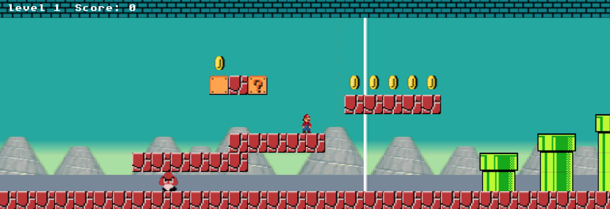

# Mario Retro Quest

*Mario Retro Quest*  is an engaging platformer game inspired by classic Mario adventure games. You'll take control of the character Mario, collect coins, change sizes by interacting with items, and defeat enemies by jumping on them.

## Table of Contents

- [**Introduction**](#introduction)
    * [Agile Methodology](#agile-methodology)
    * [The Scope](#the-scope)
- [**Design**](#design)
    * [Mario Templates Styling](#mario-templates-styling)
    * [Media](#media)
- [**Features**](#features)
   * [Home page](#footer)
   * [Navigation](#navigation)
   * [Levels](#footer)
   * [Score Page](#home-page)
   * [Win Page](#home-page)
   * [Characters and powers](#characters)
- [**How to Play**](#how-to-play)
- [**Testing**](#testing)
- [**Technologies Used**](#technology-used)
- [**Deployment**](#deployment)
- [**Credits**](#credits)

## Introduction

*Mario Retro Quest* is creative realization the classic video game, inspired by the iconic Mario series. This project was developed as a part of the [Code Institute Hackathon](https://hackathon.codeinstitute.net/hackathon/36/)

### **Agile Methodology**
Our team successfully implemented the Agile Methodology throughout the development process of the game. By employing Agile principles, we prioritized collaboration, adaptability, and iterative progress.  

### **The Scope**
Retro Quest Mario offers players an immersive platformer experience inspired by the classic adventures of Mario. The game encompasses multiple levels with varying degrees of complexity and introduces innovative gameplay elements, providing players with an enjoyable and nostalgic gaming experience.
## Features

## How to Play

1. Open the `index.html` file in your web browser.

2. Choose a character using the `left` and `right` arrow keys and press the `Space` key to start the game.

3. Use the `left` and `right` arrow keys to move through the level. Use the `Space` key to jump.

4. Collect coins to earn points and avoid encounters with enemies. Try to complete the level as quickly as possible.

5. On some levels, you can find special items such as mushrooms, stars, and fire flowers. They will give you temporary bonuses to help you overcome obstacles and enemies.

6. Go through the green pipes to advance to the next level.

7. In case of losing (falling into a pit or colliding with an enemy), you will see the defeat screen. To try again, press the `Space` key.

## Requirements

- The game requires a web browser with HTML5 support.

## Controls

- Use the `left` arrow key to move left.
- Use the `right` arrow key to move right.
- Use the `Space` key to jump.
- If your character obtains special items (mushrooms, stars, fire flowers), some additional functions will be available. For example, to use fireballs, press the `F` key.

---

Thank you for choosing *Mario Retro Quest*! Immerse yourself in the world of retro gaming with a new and exciting perspective!

---

Thank you for choosing *Mario Retro Quest*! Get ready to embark on a journey filled with nostalgia, excitement, and innovation. Let's dive into the world of retro gaming with a fresh perspective!

 