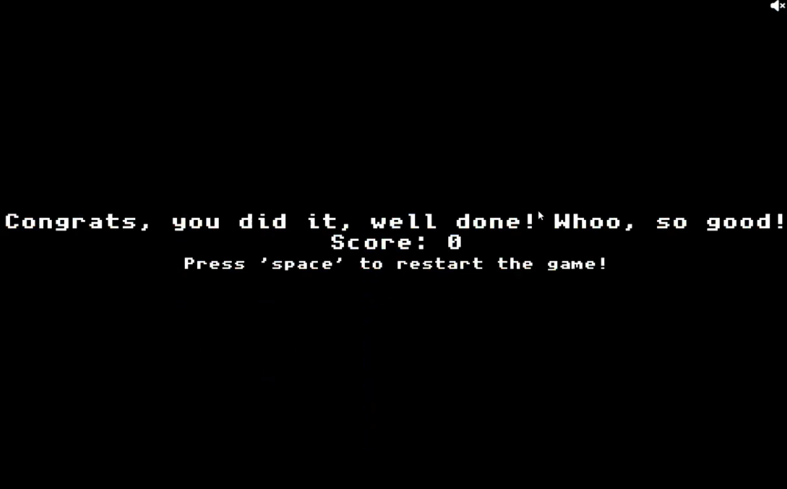

# Mario Retro Quest

*Mario Retro Quest*  is an engaging platformer game inspired by classic Mario adventure games. You'll take control of the characters from Mario world, collect coins, change sizes by interacting with items, and defeat enemies by jumping on them.

## **TABLE OF CONTENTS**

- [**Introduction**](#introduction)
    * [Agile Methodology](#agile-methodology)
    * [The Scope](#the-scope)
- [**Features**](#features)
   * [Home page](#home-page)
   * [Sounds](#sounds)
   * [Navigation](#navigation)
   * [Levels](#levels)
   * [Score Page](#score-page)
   * [Win Page](#win-page)
   * [Characters and powers](#characters-and-powers)
- [**How to Play**](#how-to-play)
- [**Testing**](#testing)
- [**Known Bugs**](#known-bugs)
- [**Technologies Used**](#technology-used)
- [**Deployment**](#deployment)
- [**Credits**](#credits)
- [**Contributors**](#contributors)

## Introduction

*Mario Retro Quest* is creative realization the classic video game, inspired by the iconic Mario series. This project was developed as a part of the [Code Institute Hackathon](https://hackathon.codeinstitute.net/hackathon/36/)

### **Agile Methodology**
Our team successfully implemented the Agile Methodology throughout the development process of the game. By employing Agile principles, we prioritized collaboration, adaptability, and iterative progress.  

### **The Scope**
Retro Quest Mario offers players an immersive platformer experience inspired by the classic adventures of Mario. The game encompasses multiple levels with varying degrees of complexity and introduces innovative gameplay elements, providing players with an enjoyable and nostalgic gaming experience.

## Features

### **Home Page**

On the main page, players can select the character they wish to play as. There are five available characters to choose from: Mario, Luigi, Peach, Donkey-kong, Ci-logo.
Players can navigate between these characters using the left and right arrow keys. To initiate the game, press the `Space` key.

### **Sounds**

By default, the game is accompanied by background music and sound effects. However, users have the option to mute both the music and sound effects by clicking on the button with a crossed-out speaker icon.

### **Navigation**

During gameplay, players can easily navigate through the game interface. At the top-right corner of the screen, players will find information about the level they are currently playing and their score at the beginning of each level.

### **Levels**

As players progress through the game, each level presents unique challenges and surprises. Different enemies are strategically placed on each level to test the player's skills. Additionally, surprises such as coins, power-ups, and items are scattered across the levels to enhance the gaming experience.

*Mario Retro Quest* offers a total of 7 levels, each with its own distinctive layout and obstacles to overcome.

### **Score Page**

In the event of the player's defeat at the end of the game, a score summary page is displayed. This page provides information about the player's score.

### **Win Page**

### **Characters and powers**

**Main characters**

At the start of the game, players have the option to select one of five main characters: Mario, Luigi, Peach, Donkey Kong, and CI Logo. All these characters possess identical abilities throughout the gameplay. During the game, they can utilize three distinct advantages: growing in size, becoming invincible, or employing fireballs.

These characters bring their unique charm to the game, and while their abilities remain the same, the choice of character adds a personalized touch to the gaming experience.

**Enemies**

The game features a diverse array of enemies that players will encounter throughout their adventure, each presenting a unique challenge. These enemies include fly-guy, goomba, koopa-green, shy-guy, wild-piranha, turtle, fireball, fireflower, evil-shroom, and blue-evil-shroom.

These characters appear on different levels of the game, each with varying movement speeds and altitudes relative to the ground. Players can defeat these enemies by jumping on top of them. It's important to note that aside from encountering these enemies, the main character is also at risk of losing a life if they fall below ground level.

### **Power-ups**

The main character has the opportunity to encounter power-ups contained within boxes, which can provide advantageous abilities. To reveal these power-ups, the player needs to jump in place and hit the boxes from below. These surprise boxes can contain various benefits, such as coins, fire weapons, size enhancement, or temporary invisibility.

## Technologies Used

The creation of the game involved the use of the following technologies:

- [Font Awesome](https://kit.fontawesome.com/7980054713.js) for sound control icons.
- [Kaboom.js](https://kaboomjs.com/lib/0.5.0/kaboom.js) game framework for building the game environment.
- Custom JavaScript code for game logic, which can be found in the `game.js` file.

## How to Play

1. Open the `index.html` file in your web browser.

2. Choose a character using the `left` and `right` arrow keys and press the `Space` key to start the game.

3. Use the `left` and `right` arrow keys to move through the level. Use the `Space` key to jump.

4. Collect coins to earn points and avoid encounters with enemies. Try to complete the level as quickly as possible.

5. On some levels, you can find special items such as mushrooms, stars, and fire flowers. To obtain these special items, jump underneath the boxes and hit them with your head. These items will grant you temporary bonuses to help you overcome obstacles and enemies.

6. Go through the green pipes to advance to the next level.

7. In case of losing (falling into a pit or colliding with an enemy), you will see the defeat screen. To try again, press the `Space` key.

## Testing

### Devices Tested
- Apple MacBook Pro 2015 | 15.4"
- Acer Aspire 7750Z | 17.3"
- iPhone 8 Plus
- Samsung Galaxy M20

### Browsers Tested
- Chrome
- Safari
- Brave
- Mozilla Firefox

### Manual Testing

#### Feature: Character Selection
When clicking the left and right arrow buttons, users can select a character, and then pressing the space key allows them to proceed to the game. This option works as expected.

#### Feature: Sounds
Clicking the crossed-out mute icon turns off the sound, and clicking the non-crossed-out icon restores the sound. This option works as expected.

#### Feature: Navigation
Upon reaching a new level, the current level and score are displayed in the top left corner. This option works as expected.

#### Feature: Levels
Users descend to a lower level when pressing the down key while on a pipe. This option works as expected.

#### Feature: Score Page
Upon losing, a page with information about the current score is displayed. This option works as expected.

#### Feature: Win Page
At the end of the game, a congratulations message and an option to start a new game are displayed. This option works as expected.

#### Feature: Power-ups
Jumping underneath boxes with surprises releases items with benefits like stars, mushrooms, coins, etc. Players can immediately utilize these advantages upon catching them. This option works as expected.

#### Basic Functions
Pressing the right, left, up, and down arrow keys moves the character in the specified direction. Pressing the space key makes the character jump. Jumping on an enemy eliminates the enemy. Pressing the F key allows the character to shoot fireballs.

## Known Bugs

1. When the main character collided with a Piranha Plant, the character did not die as expected.
   - **Resolution:** This bug was fixed by adding an action with the appropriate tag and description inside the function that determines the Piranha Plant's behavior.

2. Sound icons were unresponsive when clicked.
   - **Resolution:** The issue with the sound icons not working when clicked was addressed by (developer's comment).

3. The background image was shorter than the level length, causing a visible gap.
   - **Resolution:** The background length issue was fixed by implementing a looping function to repeat the background image seamlessly throughout the level.

4. Music from the previous level overlaped with the music in the next level.
   - **Resolution:** The problem of overlapping music between levels was resolved by (developer's comment).

## Requirements

- The game requires a web browser with HTML5 support.

## Controls

- Use the `left` arrow key to move left.
- Use the `right` arrow key to move right.
- Use the `Space` key to jump.
- If your character obtains special items (mushrooms, stars, fire flowers), some additional functions will be available. For example, to use fireballs, press the `F` key.

## Credits and sources

The game design of **Mario Retro Quest** was built upon the custom version of Mario by GitHub user [kubowania](https://github.com/kubowania). You can find her work at [this link](https://github.com/kubowania/mario/blob/main/README.md).

Images and sounds used for design were sourced from various platforms, ensuring a visually appealing and captivating experience:
### Images

- [Spriters Resource](https://www.spriters-resource.com/)
- [Mario Wiki](https://www.mariowiki.com/)

### Background sounds
-   Music from [Zapsplat](https://www.zapsplat.com)
-   Music from [Pixabay](https://www.pixabay.com)

## Contributors

This project was developed by the following contributors:

- [Alexander Tastad](https://github.com/AVTpepper)
- [Julia](https://github.com/Julia-cloudname)
- [RichRich087](https://github.com/RichRich087)
- [Quaynesworld](https://github.com/quaynesworld)
- [Rachel Furlong](https://github.com/RachelFurlong-dev)
- [jfpaliga](https://github.com/jfpaliga)

We appreciate their contributions to make this project possible.

Thank you for choosing *Mario Retro Quest*! Immerse yourself in the world of retro gaming with a new and exciting perspective!